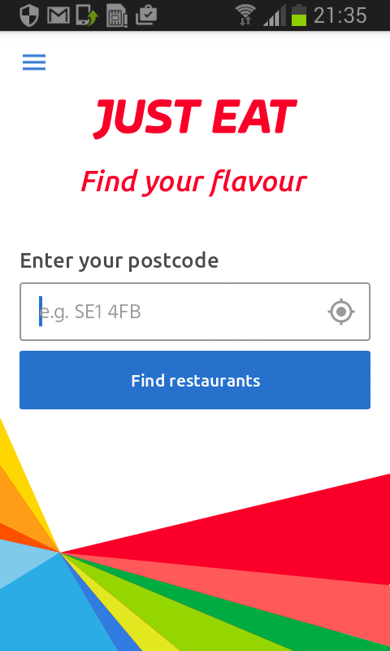

# Introduction

This is my report for the Mobile Applications MSc. There are a number of Android design principles [@androiddesign] we should follow.

As the mobile application ('app') sector continues to grow (ref?), vendors are looking for new features and approaches that will help them stick out in a crowded marketplace. This case study will focus on one business sector, fast food, and identify some requirements for a new mobile application, with reference to business trends and existing applications.

# Case study

## Background

A recent report by the Department for Environment, Food & Rural Affairs [@defra2016] showed that annual UK expenditure on catering is nearly £60 billion. In addition, the same report showed 'Special offers/promotions' to be the third most significant factor influencing consumer choice, after 'Price' and 'Quality'. This supports the idea that special offers have a very significant role to play in attracting customers to food outlets.

Fast food outlets, also known as quick service restaurants or QSRs [@farrell], are big business globally. More recently the trend towards 'fast-casual' restaurants, without table service but with a better quality of food than traditional fast food outlets, has begun to spread outside the US and is expected to have a significant impact on the UK market [@henkes].

A recent study by the Waste and Resources Action Programme [@wrap] showed that QSRs account for 25% of all meals eaten out in the UK and produce 76,000 tonnes of food waste per year, costing the sector £277m. Of this amount, 21% was ascribed to 'spoilage'. Given the need to feed an growing world population, there are therefore both commercial and moral arguments for reducing the amount of wasted food.

In the past few years there has been an explosion of apps and websites offering home meal delivery, either by takeaways themselves (via apps such as Just Eat and Hungryhouse) or more recently by 'last mile' [@ft2016] delivery companies with their own network of couriers (Deliveroo and Uber Eats). These apps have been enormously popular: Uber reported that over 100,000 people downloaded the Uber Eats app in the first few days of its launch [@ft2016]. It is clear that apps are becoming an important way that users search for and source their meals.

However, these new apps are largely focused on the home delivery market, meaning potential customers wishing to 'eat out' derive little use from them. A number of apps exist for finding local restaurants and food outlets (such as TopTable) but while these allow special menus and other offers to be highlighted, they are primarily focused on more upmarket restaurants that take reservations.

This suggests that there is therefore still potential for 'disruptive technologies' [@bower1995] to transform the way that restaurants, especially fast and fast-casual food outlets, attract customers using special offers and other promotions.

## Proposal: _halfpricesushi_

The mobile application proposed for this report will allow users to discover time-limited special offers on fast food in their vicinity. It will offer a simple and convenient interface to allow users to locate and select outlets, and allow them to share anonymous information about their experience of these outlets which can be used to improve the quality of the service for all users.

In order to provide a clear focus for development and marketing, the initial version of the app will focus on one type of special offer and one type of fast food popular in London: sushi. The Itsu chain, with annual sales of £82.6m [@telegraph], currently has 69 quick service sushi restaurants, of which 58 are in central London. The density of outlets in the capital therefore make it an ideal subject for a location-aware app. Half an hour before closing, each Itsu reduces the price of most of its cold food boxes by 50%. One reason for this offer is clearly that much of these boxes contain _sashimi_ (raw fish)

The company's founder Julian Metcalfe claims that the half-price sale, apparently inspired by those that occur in Japanese department stores, both encourages customers to try different dishes, and gives others who could not normally afford to eat at Itsu the opportunity to try it [@itsu].

Despite this focus on a type of offer, the application should be designed and implemented in a way which would allow it to support other types of food and drink in future, either within the same multi-purpose app or as a family of similarly-branded apps. The sushi application.

The target app technology platform will be Android, which continues to enjoy market dominance, accounting for over 80% of new smartphone shipments [@meeker2016]. This therefore offers the largest potential user base to evaluate and enjoy the app's features.

## Domain research

### Just Eat

The first screen that the user sees when running the Just Eat app prompts them to enter their postcode:

{ width=50% }

As an alternative to entering a postcode manually, tapping the crosshair symbol to the right-hand side of the input box activates the device's geolocation feature to be used instead. This symbol is consistent with its use elsewhere on the Android platform, however research suggests that truly universal icons are rare and should therefore be accompanied by a text label to eliminate ambiguity [@harley].

## Requirements

Before work can begin on designing the user interface for the app we need to explore how the system is going to work systematically. This process of requirements gathering should consider both _functional_ and _non-functional_ requirements. The division between these two classes of requirements will be discussed below.

Arlow and Neustadt [-@arlow] propose using simple 'shall' statements combined with unique identifiers to capture requirements, e.g.

> _id_ The _system_ shall _function_

For the purposes of setting requirements I will take a similar approach, omitting the repeated phrase "The app shall". In addition, it is useful to capture the relative _priority_ of requirements to help in planning the development process. For this project we will use the requirement level terminology formalised by RFC 2119 [-@bradner]. Other options include the MoSCoW criteria (Must have, Should have, etc.) described by Arlow and Neustadt [-@arlow].

In a normal requirements gathering process we might perform interviews or workshops with stakeholders or use questionnaires to elicit information. For the purposes of this project, functional and non-functional requirements will be identified primarily based on the background and domain research described above, along with the applicable Android design principles [@androiddesign].

These requirements describe only a minimum viable product (MVP), in other words an acceptable version of the app that could be released and used to learn more about customer needs through testing and other research. Future iterations of the development cycle may add additional requirements based on user feedback and new business requirements.

### Functional

Functional requirements define things that the product must do in order to be useful to the person using it [@robertson2012]. For example, a weather application needs to be able to give information about the weather forecast for the next few days. Below is a table summarising the functional requirements that have been identified for this case study.

Identifier Description                                                Priority
---------- ---------------------------------------------------------- --------
      FR01 Show offers based on the user's physical location             Must
      FR02 Show offers based on remaining duration                       Must
      FR03 Display detailed information about each offer and location    Must
      FR04 Allow user to specify location manually                     Should

Table:  Summary of functional requirements

These requirements are explained and justified in detail in the following sections.

#### FR01: List offers based on proximity to the user's location, if known

As GPS receivers have become a standard feature on smartphones, users now expect mobile apps containing location-specific information to give them the option of sharing their position automatically via the phone's geolocation facility. Avoiding having to manually select a location is an example of 'adaptive user experience' and can be an important way of saving the user time and giving them a seamless experience [@wimberley].

It should be noted that not all smartphone owners are comfortable with using geolocation features, sometimes because of doubts over how information about their location might be used by app developers. A recent survey [@punchtab] showed that 50% of mobile users were reluctant to share their location due to privacy concerns. However, the same survey showed that the biggest reason given (88%) for users to allow location tracking was the availability of "coupons or special offers". This suggests that users will be prepared to allow _halfpricesushi_ to access their location because it will provide them with such offers. However the app should be designed so that it is still usable even without access to location services.

#### FR02: List offers based on start and finish time

Since one of the unique selling points of the app is the ability to provide time-limited special offers, it makes sense that users should be able to see which offers are starting or finishing near them soon. The user interface should summarise the start and finish time (and optionally, the remaining duration) of each offer in a way that is easy to understand, along with its location. This will allow the user to make a decision about which offer to use based on both time and location factors.

#### FR03: Allow users to customise the sort order of the list view

Users may wish to sort the list of offers either by distance or by time remaining. This feature should be provided via a button in the app Action Bar. However, the button should only be shown in when the list view is visible, not in the map view, thereby following the Android Design Principle [@androiddesign] of _only show what I need when I need it_.

#### FR04: Display a detailed view of each offer and location

Once the user has identified an offer that they are interested in, they should be able to tap or click on it to see a more detailed view. The detailed view should provide all information that the app holds about the offer, along with any applicable time restritions (such as opening hours). The detailed view should also give an indication of the location where the offer can be redeemed, such as through a simplified (non-interactive) small map.

#### FR05: Provide map-based view of all offers in the surrounding area

Instead of viewing a list of offers based on proximity, users may prefer to see a graphical map showing their position in relation to the offers around them. This is because some users express a preference for (ref?) graphical visualisations over textual list-type views. Providing a map-based interface also adheres to the Android Design Principle _real objects are more fun than buttons and menus_. [@androiddesign]. However, care must be taken not to 'overload' view with an excessive number of markers which may obscure map details and prevent users from orienting themselves in the surrounding area.

#### FR06: Allow user to see their location in the map view

Users are accustomed to map views offering a 'My Location'-type feature which indicates their current position in relation to places of interest around them, often using a blue dot. This type of feature should also be incorporated into the map view for consistency with other apps such as Google Maps itself.

#### FR07: Indicate which offers currently avaible using graphics

Following the Android Design Principle that _pictures are faster than words_ [@androiddesign], the user interface should use graphics and other visual effects (such as highlight colours) to identify the status of each offer. An example of this would be to use a different icon to represent an offer that is currently available on list and map views, rather than a simple piece of text. However, if icons are used, care should be taken to ensure that they are easily understood by the majority of users (ref Hamburger icon article) and do not create confusion.

#### FR08: Initialise database of available offers using external API

The list of offers available using the app may change periodically as new partners decide to participate or existing partners decide to change the terms of their offers (for example start or end times). To ensure that the app always offers the most up-to-date list of available offers when it is installed, the offer database should be obtained by making a call to a central REST API when the app is run for the first time.

If problems occur when initialising the database from the web API, the app should give the user the opportunity to retry the operation, avoiding unneeded technical detail. This adheres to the Android Design Principle of _it's not my fault_ [@androiddesign].

#### FR09: Update offer database automatically using API without requiring app update

Users should be able to take advantage of udpated offer information without having to upgrade or reinstall the app itself. The app should periodically check the API in order to update its local database of offers. However the update process, and in particular any network errors that occur, should not interfere with the normal operation of the app (again, as per _it's not my fault_).

#### FR10: Support adding users' personal ratings for each offer

The Android Design Principle _let me make it mine_ [@androiddesign] states that users like to add personal touches and 'optional customisations'. This principle is met by allowing users to assign a 'star rating' on the detailed offer view. The star rating they give each offer should be stored by the app and redisplayed on subequent uses of the detailed view, also following the principle of _never lose my stuff_.

#### FR11: Upload anonymised user ratings to central database

When a user has added a personal rating for an offer, as well as storing the rating internally the app should attempt to submit the rating to a central database (including the offer identifier, rating and date and time when the rating was set). At this stage no personally identifiable data (such as location) should be sent to the server to avoid infringing the user's privacy. A server using a REST API will be made available to receive ratings sent by the app.

The rationale behind this requirement is to build up a central database of ratings that could be used to provide additional features in future based on which offers have the highest (or lowest) user rating. For example, a shop with a large selection of reduced items could be highlighed by the app for special consideration by the user.

#### FR12: Use simple sound effects to respond to user actions

Following the Android Design Principles [@androiddesign] _delight me in surprising ways_, the app should make judicious use of sound effects to respond to and reward user activity. An effect should be played both when a user opens the detailed view of an offer and when they as a personal rating for the offer. The goal is to encourage the user to interact with the app more and make their experience more enjoyable.

### Non-functional

Non-functional requirements are other qualities that the product must have in order to be acceptable to the user [@robertson2012]. These may include such properties as security, capacity, performance and compliance to standards. They can also be described as constraints placed on the system [@arlow].

#### NFR01: Support up to 1000 offers at one time without impaired function

The app should be able to handle a large database of offers to allow it to continue to be work effectively even many additional partners are signed up. The initial offer database is expeced to contain less than 100 offers, however the behaviour of the app with up to 1000 offers should not be noticeably impaired in any way.

#### NFR02: Respond to all user interactions within 100ms

#### NFR03: Localisation support

As the app may be launched in future in other countries, it is essential that it can be easily translated into other languages. For this reason all strings and graphical text used within the app should be stored using localised resources instead of being hard-coded. The default language may be assumed to be English. No special support for right-to-left text or layouts is required for the MVP app.

#### NFR04: Accessibility

?

#### NFR05: Standards? Privacy etc?

# Prototype

## User interface

Although as Nielsen [-@nielsen1996] points out, 'Designers Are Not Users', and we should be wary of using our intuition alone in making design decision, for the purposes of creating an MVP for this project I have used my own desires and expectations as a guide in organising the user interface.

# Architecture

## Model View Controller

Model View Controller (MVC) is a well-established pattern in application architecture for creating a separation of concerns between user interface and business logic and/or domain model.

According to Fowler [@fowler] the separation of presentation from model is of fundamental importance in software architecture. It allows code that describes business logic and provdes access to data (for example via databases or APIs) to be developed and tested separately, independently of the user interface, and enables the possibility of reusing the same model code with different interfaces (such as a website and the command-line). It also allows for greater specialisation of development skills within different areas, and simplification of the development process.

The MVC pattern originated in experiments in graphical interfaces conducted at Xerox PARC the late 1970s and was originally implemented for the Smalltalk language. As originally conceived, the model is an abstract representation of some type of knowledge, while the view or views are representations of that model that the user can interact with, while creating the impression they are seeing and manipulating the model directly [@reenskaug].

The exact role of the controller has been interpreted differently by authors. Fowler says that the controller takes user input, manipulates the model and causes the view(s) to update [@fowler]. However, Reenskaug's proposal was that views handle their own user input, with the controller only responsible for coordinating views and handling level at the input of the whole application [@reenskaug]. It is worth noting that Fowler believes the precise separation between view and controller (V/C) is less important than the separation between model and presentaion (M/VC).

As with other layered architectures, the potential benefits of MVC are that it helps to manage the complexity of a large application, allowing new developers to understand the codebase and find where a particular piece of functionality is implemented. This may lead to a reduction in maintainance costs. As a form of modularisation, it also facilitating reuse of code, and enables the implementation of different parts of the application to be changed by reducing the amount of coupling between classes.

## MVC and the Android platform

The Android platform supports an MVC architecture but does not enforce the use of any one paradigm. Instead developers have to make conscious decisions to avoid mixing data/model and presentation concerns within the same layer. Apart from the provided `View` class hierarchy, Android does not use MVC terminology directly. However, one typical way of mapping MVC into Android is outlined by [@bignerd]:

- model classes are custom Java classes (which do not normally inherit from Android platform classes). 
- the view(s) layer are the Android `View` classes (usually instantiated through the layout file mechanism), which are able to draw themselves and handle user input
- the 'controller' is collection of the `Activity`, `Fragment` and/or `Service` classes that contain all the application logic and manage the flow of data between the model and view layers

According to [@fowler] the model in MVC should be essentially non-visual and not depend on any user interface components. In practical terms, this strongly suggests that the model classes in an Android app should not `import` any Java classes that correspond to user interface features, such as `View`s or `Fragment`s. Where model classes have unit tests, this also allows them to be run in isolation without any dependency on a specific version of the Android API.

Another way that separation between model and presentation can be encouraged is to use a separate Java package for the model classes. Fields and methods that are only used within model classes can therefore be declared as package-private through the omission of any explicit access level modifier [@javaaccesscontrol]. This helps to restrict access to the model from other packages (such as those containing user interface classes) to its public interface, and supports the object-oriented design principle of encapsulation [@booch]. As a secondary benefit, it permits the model implementation (for example, the choice of persistence layer) to change without affecting the rest of the application.

An essential feature of MVC on Android as described by [@bignerd] is that there must be no direct communication between model and view classes - the controller(s) always acts as an intermediary, updating views with changes to model objects and changing models as required in response to user input. This is effectively an application of the so-called Law of Demeter [@booch] which requires code units to only communicate with other directly-related code units. Model classes should know nothing about the widgets and other user interface components used to represent them.

Fowler [@fowler] identifies one common problem for rich clients: the need to ensure consistency of data across multiple views. Any change to the model, whether caused by a user interacting with one presentation or by external events, needs to be reflected across all presentations. In the Android platform we can approach this problem by ensuring that `Fragment`s register event listeners for any changes to the model they use.

## Use of MVC within _halfpricesushi_

Reenskaug suggests that the MVC paradigm is beneficial when the user needs to see the same data in different contexts and/or different viewpoints [@reenskaug]. The _halfpricesushi_ app has exactly this requirement, showing users information about special offers using three different 'views':

  - as an ordered textual list
  - arranged as markers on a geographical map
  - in a 'close up' view of an individual offer with additional details

The model classes have been organised into a separate package, `io.github.jamesdonoh.halfpricesushi.model` to show the separation of model and presentation. Additionally, package-private access has been specified for members that should not be used outside the package (for example, the constructor for the `Outlet` class).

    (add diagram showing activity acting as intermediary?)

The `Activity` and `Fragment` classes used within the app act as controllers, with no direct interaction between model and view classes. Additionally, the use of a `RecyclerView` within `OutletListFragment` allows the underlying data source (a `List` of `Outlet` instances) to be abstracted away from the list view layer via a custom `RecyclerView.Adapter` subclass (note that this class is not a part of the `.model` package itself, although it manages objects from that package). The `RecylerView` does not interact directly with any `Outlet` objects directly but delegates this behaviour to the `Adapter` and `ViewHolder` abstractions.

# Development

# Testing

During and after development it is essential to incorporate testing using a variety of approaches. This project includes different types of testing:

- Unit testing
- Functionality testing
- Usability testing

The following sections describe the approach taken for each of these in more detail.

## Unit testing

## Functionality testing

## Usability testing

Whether a mobile app is usable can be equally important as whether it is functional. Usability is is defined by ISO 9241-11 as the 

> extent to which a product can be used by specified users to achieve specified goals with effectiveness, efficiency and satisfaction in a specified context of use [-@iso9241, section 3.1] 

As Brooke [-@brooke] points out, in order to assess these three characteristics of effectiveness, efficiency and satisfaction we also need to consider the context in which the product or system is used and the purpose it used for. The effectiveness of an online clothes' retailer's website cannot be easily compared to the effectiveness of a system for managing railway track safety. 

Several measures exist for making subjective assessments of usability, usually through questionnaires which users of the system are asked to complete by putting a numeric score against a series of statements or prompts. Although a custom metrics could be created for each research exercise, one advantage of using a ready-made scoring system is that it allows for rough comparison both across versions of a product and between different products.

The System Usability Scale (SUS) created by Digital Equipment Corporation is one such measure [@brooke]. It is implemented as a Likert scale where the respondent indicates their level of agreement or disagreement with statements such as _I found the system unnecessarily complex_. The SUS has only ten questions and can therefore be completed quickly and easily.

Using an existing scale also reduces some of the costs associated with usability research. Nielsen has described an approach called 'Discount Usability Engineering' [@nielsen1996] which relies on the following techniques:

- User and task observation
- Scenarios
- Simplified thinking aloud
- Heuristic evaluation

Nielsen [@nielsen1993] defines five attributes which can be used to judge the usability of a system via a questionnaire or other evaluation process. The following table lists these attributes along with examples of ways they could be used to evaluate the specific app being developed:

Attribute                Question
------------------------ ------------------------------------------------------
Learnability             How much effort is required for a new user of the app to learn its features
Efficiency               Can experienced users of the app achieve their goals quickly?
Memorability             Do users find it easy to remember how to use the app's features on subsequent visits
Errors (Accuracy)        How often to errors occur in normal operation of the system? How well are they handled?
Subjective Satisfaction  Do users like the app? Are they satisfied that it is usable?

# References
